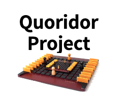
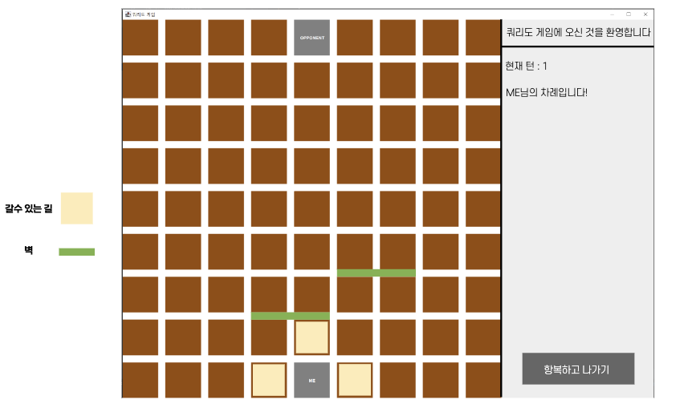

 

    

  <h1 align="center">쿼리도 게임 개발 프로젝트</h3>

  

    팀원: 신종웅 | 최재혁 | 홍지현 | 송영빈
     
     
    <strong>자바 프로그래밍 팀 프로젝트</strong>
    
  

 
 

## About The Project

쿼리도는 멘사 셀렉트의 한 보드게임으로 기본적으로 2~4인 게임 입니다.

각각의 플레이어들이 말을 가지며 상대 진영으로 먼저 보내면 
게임에서 승리하게 됩니다.

상대 플레이어가 가는 경로를 내 나무토막으로 막아서 상대가 오는 것을 막을 수 있습니다.

두개의 클라이언트에서 소켓 통신으로 게임을 할 수 있도록 구현되었습니다.
